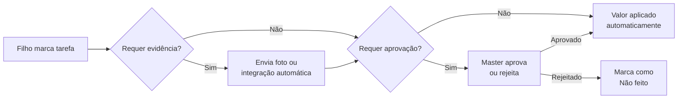
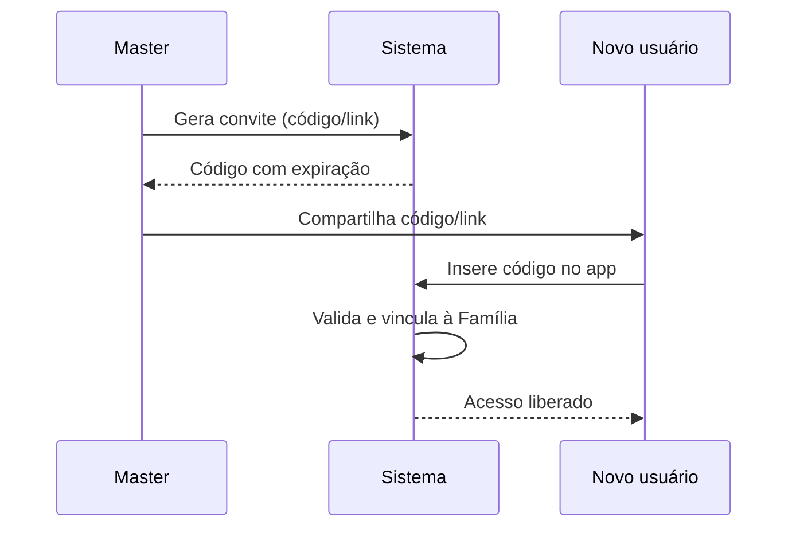

# Especificação — App de Controle de Mesada

> Cópia versionada da especificação funcional. Fonte editável (documento vivo):
> https://claude.ai/artifact/EW6oah9zbQ9syam7WUaypL — em caso de divergência,
> atualize este arquivo a partir da fonte antes de iniciar uma nova etapa de
> desenvolvimento.

## Visão Geral

Aplicação para controle da mesada dos filhos. A mesada tem um valor base fixo
por filho, que pode aumentar ou diminuir conforme a conclusão (ou não) de
tarefas e atividades cadastradas.

Categorias de atividades cobertas: tarefas de casa, tarefas escolares, cursos,
esporte, artes marciais, trabalho voluntário, trabalho remunerado, apoio a
familiares, entre outras definidas pelo Master.

Modelo de negócio: SaaS multi-tenant, com intenção de comercialização para
outras famílias além da do idealizador.

## Perfis de Usuário e Multi-tenant

Arquitetura multi-tenant: cada família é um tenant isolado, com isolamento de
dados por `familia_id` via Row Level Security no PostgreSQL. Uma conta master
pode gerenciar N usuários comuns; o sistema suporta N famílias independentes.

| Papel | Escopo | Permissões-chave |
|---|---|---|
| Administrador | Sistema inteiro | Gestão de famílias e assinaturas, suporte, métricas de uso |
| Master Financeiro | Uma família | Tudo do Master + cancelar/alterar assinatura, adicionar/remover outros Masters, excluir a conta da família |
| Master | Uma família | Cadastro de filhos, categorias e tarefas customizadas, aprovação de tarefas |
| Comum (filho) | Uma família | Consulta de tarefas e indicação de conclusão |

Uma família pode ter múltiplos Masters (ex.: pai e mãe), cada um com login
independente. O primeiro Master de uma família é, por padrão, o Master
Financeiro.

## Categorias e Subcategorias de Tarefas

Modelo híbrido: o sistema traz categorias padrão pré-cadastradas (Casa,
Escola, Esporte, Cursos, Trabalho, Voluntariado, Apoio Familiar) e o Master
pode criar categorias e subcategorias próprias.

Cadastro de categorias/subcategorias é exclusivo da Web — não disponível no
app mobile.

## Cadastro e Parametrização de Tarefas

Cadastro exclusivo da Web. Cada tarefa precisa estar associada como aderente a
um usuário comum para gerar valor.

| Campo | Descrição |
|---|---|
| Nome | Nome da tarefa |
| Categoria/Subcategoria | Vínculo com o cadastro de categorias |
| Pontuação | Peso em pontos (modo Pontos) |
| Valor (R$) | Valor direto (modo Valor Direto) |
| Permite parcial | Sim/Não — habilita percentual de conclusão |
| Tipo | Recorrente ou Avulsa |
| Validade (avulsa) | Data-limite para conclusão; expira sem conclusão vira "Não feito" |
| Natureza | Bônus ou Obrigatória |
| Requer aprovação | Sim/Não, configurável por tarefa (padrão: Sim, para tarefas com evidência manual) |
| Evidência | Foto obrigatória por padrão; integração automática (Strava, Google Fit/Apple HealthKit) para tarefas de esporte |
| Valor de multa | Aplicável apenas a tarefas Obrigatórias não cumpridas; configurável, independente do valor da tarefa |

## Lógica de Cálculo

Cada tarefa usa um de dois modos de parametrização.

**Modo Valor Direto:**

```
Valor_tarefa = Valor_cadastrado × (%Conclusao / 100)
```

**Modo Pontos** (converte pontos em R$ por uma taxa configurável, o "valor do ponto"):

```
Valor_tarefa = (Pontos_cadastrados × Valor_ponto) × (%Conclusao / 100)
```

**Fechamento do ciclo:**

```
Mesada_final = Mesada_base + Σ Valor_bonus − Σ Valor_multa
```

Onde `Valor_multa` é o valor de multa cadastrado nas tarefas Obrigatórias não
cumpridas — configurável, independente do valor que a tarefa geraria se
concluída. Se `Mesada_final` for negativa, o saldo zera e o débito é
acumulado para o próximo ciclo.

### Sugestão Automática de Valor

Ao cadastrar uma tarefa, o sistema sugere um valor ou pontuação inicial,
dividindo a base disponível pela quantidade de tarefas já aderentes ao filho.
A sugestão recalcula sempre que uma tarefa é adicionada ou removida da
aderência — o Master pode sobrescrever o valor sugerido a qualquer momento.

```
Valor_sugerido = Mesada_base / N_tarefas_aderentes         (Modo Valor Direto)

Pontos_totais = Mesada_base / Valor_ponto
Pontos_sugeridos = Pontos_totais / N_tarefas_aderentes      (Modo Pontos)
```

`N_tarefas_aderentes` = quantidade de tarefas vinculadas ao filho no momento
do cálculo, em cada modo.

## Ciclo de Mesada

Periodicidade de fechamento configurável por usuário comum: semanal,
quinzenal, mensal ou personalizada.

O sistema mantém histórico de todos os fechamentos por ciclo, com o
detalhamento de tarefas concluídas, bônus e multas aplicadas — base para o
extrato e os relatórios.

## Fluxo de Aprovação de Tarefas



Padrão de fábrica: toda tarefa nova com evidência manual exige aprovação do
Master. O Master pode liberar aprovação automática por tarefa depois de
cadastrada.

## Notificações

Canais: push (Firebase Cloud Messaging) e e-mail (SendGrid ou Resend). Master
pode configurar, por família, quais eventos geram notificação em cada canal.

| Evento | Destinatário |
|---|---|
| Tarefa pendente | Comum |
| Aprovação necessária | Master(es) |
| Tarefa aprovada/rejeitada | Comum |
| Mesada fechada (ciclo) | Master(es) e Comum |
| Tarefa avulsa expirando | Comum e Master(es) |

## Planos e Assinatura

Cobrança por família (assinatura), com gestão exclusiva do Master Financeiro.
Gateway de pagamento (Asaas ou Stripe) abstraído por uma interface própria
(`IPaymentProvider`), para permitir troca ou adição de gateways sem impacto no
restante do sistema — incluindo integração futura com plataformas de
terceiros.

| Recurso | Free | Básico | Premium |
|---|---|---|---|
| Filhos (usuários comuns) | 1 | Até 3 | Ilimitado |
| Masters adicionais | Não | 1 adicional | Ilimitado |
| Categorias/tarefas customizadas | Não | Sim | Sim |
| Integrações externas (Strava, Health) | Não | Não | Sim |
| Relatórios/dashboards | Extrato básico | Completo | Completo + comparativos |
| App mobile offline | Sim | Sim | Sim |
| Suporte | Self-service | Padrão | Prioritário |

Preços dos planos Básico e Premium: parametrizáveis pelo Administrador, sem
necessidade de deploy para alterar valores.

### Troca de Master Financeiro

- O Master Financeiro atual indica o novo Master Financeiro, dentre os
  demais Masters da família, antes de sair
- O novo Master Financeiro cadastra suas próprias opções de pagamento
- Papel e permissões de Master Financeiro são transferidos após a
  confirmação da nova forma de pagamento

## Requisitos Não-Funcionais

- **LGPD — dados de menores (art. 14):** cadastro do filho coleta só
  nome/apelido, sem documento. Termo de consentimento específico aceito pelo
  Master no cadastro, cobrindo nome, fotos de evidência e dados de
  tarefas/pontuação. Vedado uso dos dados para publicidade direcionada à
  criança.
- **Retenção de dados:** ao excluir a família, dados retidos pelo período
  legal mínimo e depois anonimizados/excluídos.
- **Segurança de API:** autenticação OAuth2/JWT; isolamento multi-tenant
  garantido por Row Level Security no PostgreSQL.
- **Autenticação mobile:** filhos e Masters adicionais ingressam por
  código/link de convite (sem e-mail/documento do filho); bloqueio local (PIN
  ou biometria do aparelho) recomendado após o vínculo inicial. Código de
  convite expira e pode ser reemitido (ex.: troca de aparelho).

## Stack Técnica e Arquitetura

| Camada | Tecnologia |
|---|---|
| Backend | .NET C# — API RESTful multi-tenant |
| Banco de dados | PostgreSQL com Row Level Security |
| Web | Angular (build/deploy via Lovable) |
| Mobile Android | Kotlin nativo |
| Mobile iOS | Swift nativo |
| Offline (mobile) | SQLite local + fila de sincronização |
| Autenticação | OAuth2/JWT + biometria no mobile |
| Pagamentos | Asaas ou Stripe, atrás de `IPaymentProvider` |
| Notificações | Firebase Cloud Messaging (push) + SendGrid/Resend (e-mail) |
| Storage de evidências | Compatível com S3 |
| Versionamento | GitHub |

## Modelo de Dados — Entidades Principais

- **Familia** (tenant): id, plano, ciclo de fechamento padrão
- **UsuarioMaster**: vínculo com Familia; flag `is_financeiro`
- **UsuarioComum**: vínculo com Familia; nome/apelido; ciclo de fechamento
  próprio; saldo devedor acumulado
- **Categoria / Subcategoria**: padrão do sistema ou customizada por Familia
- **Tarefa**: vínculo com Categoria; pontos, valor, % permite parcial, tipo
  (recorrente/avulsa), validade, natureza (bônus/obrigatória), valor de
  multa, `requer_aprovacao`
- **TarefaUsuario** (aderência): vínculo N:N entre Tarefa e UsuarioComum
- **Execucao**: instância de uma Tarefa em um ciclo — status
  (feito/parcial/não feito), % conclusão, evidência (foto ou integração),
  status de aprovação
- **CicloMesada**: fechamento por UsuarioComum — mesada base, soma de bônus,
  soma de multas, valor final, saldo devedor transportado
- **Assinatura**: vínculo com Familia; plano; status; histórico de cobrança
- **ConviteAcesso**: código/link, papel-alvo (Master ou Comum), status,
  expiração

## Módulo Administrador

- Gestão de famílias: listar, auditar, suspender contas
- Gestão de assinaturas: planos, cobranças, cancelamentos em nível de sistema
- Suporte: visualização e tratamento de tickets/ocorrências reportados por
  Masters
- Métricas e uso: dashboards internos de adoção, retenção e receita
- Gestão de categorias/tarefas padrão do sistema (as que vêm pré-cadastradas
  para todas as famílias)

### Telas do Administrador

| Tela | Conteúdo |
|---|---|
| Dashboard Geral | Métricas de adoção (famílias ativas, MRR, churn), gráfico de crescimento |
| Famílias | Lista de famílias, status da assinatura, ações de suspender/reativar |
| Detalhe da Família | Dados da família, Masters vinculados, filhos, plano, histórico de billing |
| Controle de Acessos | Gestão de administradores do sistema, permissões por administrador, log de auditoria |
| Assinaturas | Lista de assinaturas, status de cobrança, planos, cancelamentos |
| Suporte | Fila de tickets/ocorrências reportados pelos Masters |
| Categorias Padrão | Gestão das categorias/tarefas padrão disponíveis a todas as famílias |

## Fluxo de Convite

Mesmo mecanismo para vincular um filho (usuário Comum) ou adicionar um novo
Master (ex.: cônjuge) à família.



Se o código expirar antes do uso, o Master pode reemitir um novo convite para
o mesmo perfil.

## Telas e Dashboards do Master (Web)

| Tela | Conteúdo |
|---|---|
| Dashboard da Família | Saldo atual de cada filho, tarefas pendentes de aprovação, alertas |
| Controle de Acessos | Masters vinculados à família, convites pendentes, revogação de acesso |
| Gestão de Filhos | Lista de filhos, edição de dados (nome/apelido), ciclo de fechamento, tarefas aderentes |
| Extrato e Histórico | Ciclos fechados, tarefas concluídas e multas aplicadas, filtrável por filho e período |
| Gráficos de Desempenho | Desempenho por categoria de tarefa, comparação entre filhos |
| Aprovações Pendentes | Fila de tarefas aguardando aprovação, com evidência anexada |
| Assinatura (só Master Financeiro) | Plano atual, forma de pagamento, histórico de cobrança, cancelamento |
